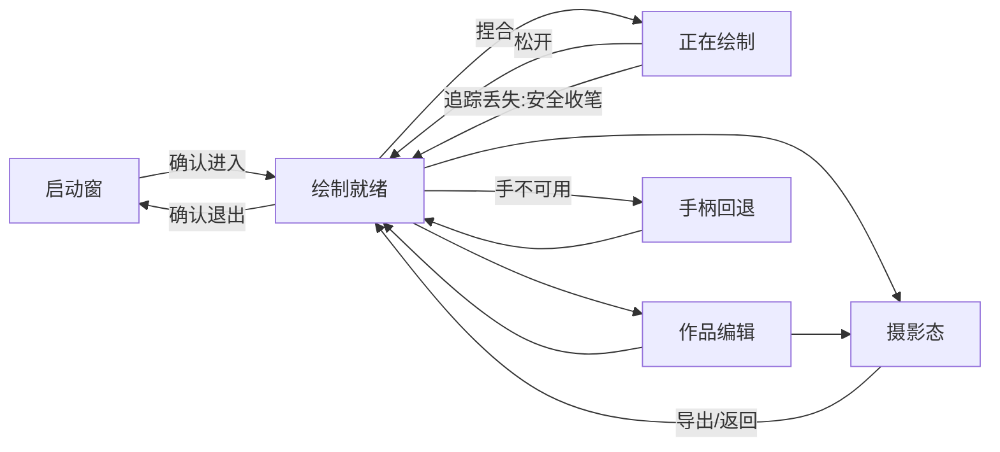

# Interaction / Spatial Design Spec · AirRibbon

> Roles: `task_decision_designer`, `interaction_xr_designer`, `spatial_design_system_designer` | active revision: 5 | sources: PM r6, UXR r5, visual r3 | CR-DS-1

## 1. Direct Description of Outputs

本规格从任务决策推导空间价值、三个概念假设与选型；后续章节在 Stage 9–11 追加容器、状态、交互、动效和布局事实。

## 2. Design Principles

| ID | Assertion | Scope | Basis | Checkpoint | Precedence |
|---|---|---|---|---|---|
| P1 | 安全收笔优先于保留轨迹：tracking lost、切模式或系统中断均立即终止当前笔，绝不跨 gap 插值 | input/safety | PM Q2; UXR F1 | TR-TRACK-LOST; TrailCanvas states | highest |
| P2 | 绘制、编辑作品、摄影三个模式互斥；任一时刻只允许一个主要操控语义 | interaction | PM Q4; UXR F2 | ModeGate + state graph | after P1 |
| P3 | 快速成形优先于参数完备：仅 3 笔刷×3 色×3 粗细，首笔 ≤60s | product/UI | PM Q1; UXR differentiation | BrushPalette | after safety |
| P4 | 性能预算先约束数据和网格，再做视觉装饰 | engineering | PM A5; D2 | Stroke ≤512; HandTrailMesh budget | after safety/usability |
| P5 | 相对布局恢复是明确范围，绝不暗示同一房间持久锚定 | trust | PM Q7 | SaveStatus copy | after safety |

- **冲突仲裁**：P1 > P2 > P4 > P3 > P5；追踪安全可打断美学连续性，性能降级不得破坏模式与安全状态。
- **禁止**：跨 gap 连线、专业建模 gizmo、无限历史、强制相机位移、隐藏持久化边界、仅颜色表达状态。

## 3. Task / Decision Model

| ID / Task | Actor / Scenario | Inputs | Decision output | Error consequence | Frequency | Dependencies | Target duration |
|---|---|---|---|---|---|---|---|
| T1 选择笔触 | 创作者/绘制前或笔间 | brush/color/width 当前值 | BrushSpec 快照 | 意外材质但可撤销 | 每笔前可选 | none | ≤2s |
| T2 开始并完成一笔 | 手势用户/绘制态 | pinch、hand pose、tracking confidence、point budget | finalized Stroke 或安全结束 | 飞线/误画/性能爆炸 | 高频 | T1,T3 | 首笔≤60s |
| T3 判断采样/降采样 | system/绘制中 | 距离、角度、点数、curvature | append/skip/resample | 形状失真或过量顶点 | 每采样 tick | T2 | frame budget内 |
| T4 切换作品编辑 | 用户/完成若干笔 | mode、active stroke | enter Edit; active stroke finalized | 移动时误画 | 会话数次 | T2 | ≤1s反馈 |
| T5 变换作品组 | 用户/编辑态 | group transform、双手/手柄输入 | move/uniform scale/rotate | 丢失构图 | 会话数次 | T4 | continuous |
| T6 撤销或清空 | 用户/任意非进行中笔 | undo depth、stroke count | undo latest / confirm clear | 误删 | 常用/低频 | T2 | undo≤2s |
| T7 摄影导出 | 用户/摄影态 | framing、export permission/path | saved image or retry | 分享失败/错误成功提示 | 会话末 | T4 | ≤10s target |
| T8 本地保存恢复 | system/修改/重开 | strokes、relative group transform、schema version | valid save/load or last-good fallback | 作品丢失/预期错位 | 修改后/重开 | T2,T5 | debounce≤1s |
| T9 手柄回退 | controller user | ray/trigger/grip/buttons | select/undo/transform/export; simplified ray stroke | 无法闭环 | when needed | all | parity of core outcomes |

- **依赖**：T1→T2↔T3；T2→T4→T5→T7；T6/T8 横切；T9 替代输入而非新模式。
- **竞品覆盖核对**：覆盖绘制、笔刷、选择/整体变换、相机、保存/导出；刻意不包含建模、协作、复杂环境和大量笔刷。

## 4. Spatial Value Justification

| Task | Spatial value | Rationale | 2D counterfactual | Benchmark | Rating |
|---|---|---|---|---|---|
| T2 | direction/distance/depth/body/motion/time | 手的三维路径本身就是作品 | 2D 屏幕用 x/y+压力，只能模拟深度 | C1/C2 空间绘制能力 | High |
| T5 | position/scale/depth/body | 对整件空间雕塑直接抓取、绕看与缩放 | 2D viewport 用 gizmo，间接且专业 | C2 整体操控机会 | High |
| T7 | position/depth | 摄影视角需要在空间中构图 | 2D 可旋转模型并截图，功能足够但身体构图弱 | C1 camera expectation | Medium |
| T1/T6/T8 | none/low | 平面控件更清晰，不因 XR 浮窗强行空间化 | 普通按钮/列表完全足够 | avoid pseudo-spatial UI | Low; keep planar/in-situ |

- **完整维度判定**：collaboration=`none`（单人范围，PM §5）；simulation=`none`（不模拟物理或专业材料，仅实时几何反馈）；time 仅体现在轨迹形成与撤销历史；不因这些维度缺失而添加伪空间能力。
- **整体 2D 反事实**：平板应用可用触控曲线、伪 3D 旋转预览、分模式工具栏与截图完成相同管理闭环，但不能让手的真实三维路径直接决定方向/深度/身体尺度，因此 Stage 只服务 T2/T5/T7，管理任务仍保持平面语义。

## 5. Design Hypotheses

| Hypothesis | Information model | Spatialization | Containers | User path | Primary interaction | Risk / cost |
|---|---|---|---|---|---|---|
| A 空中速写台 | 三模式+最小随手工具带；作品为单一组 | Stage Mixed 中直接绘制/抓组 | 启动 Planar + Stage；Stage 内 world-space 工具托盘 | 进入→画→编辑→拍 | 手势直接绘制、抓取 | 中；需手追踪和网格 |
| B 桌面体积画布 | 有边界 Volumetric 盒，所有 UI 固定边缘 | 在有限盒内绘制 | Shared Space Volumetric only | 启动即在盒内画 | 手势/射线 | 低-中；易裁切，空间价值受限 |
| C 分镜式雕塑工坊 | 每阶段独立窗口/Stage 区域，带步骤向导 | 高度结构化，逐步确认 | 多 Window + Stage | 选型→绘制→整理→导出 | 目光/捏合向导 | 高；步骤慢、遮挡多 |

## 6. Concept Selection Matrix

评分 1–5；风险维度 5 表示更安全。

| Hypothesis | Task efficiency | Spatial value | PICO comfort | Domain depth | Safety | Accessibility | Feasibility | Uniqueness | Total /40 | Verdict |
|---|---:|---:|---:|---:|---:|---:|---:|---:|---:|---|
| A | 5 | 5 | 4 | 5 | 4 | 4 | 4 | 5 | 36 | Selected |
| B | 4 | 3 | 5 | 3 | 4 | 4 | 5 | 3 | 31 | Rejected: boundary clips body-scale strokes |
| C | 2 | 4 | 3 | 4 | 5 | 3 | 2 | 4 | 27 | Rejected: too many steps/windows for toy goal |

**决胜分 evidenceRefs / rationale**

- A efficiency 5：PM Q1/Q4 + UXR F2，三态互斥且首笔路径最短；A spatial 5：§4 T2/T5 为 High。
- A comfort 4 / safety 4：P1 安全收笔、Stage Mixed、无强制相机；仍是设计判断，真机舒适度 `not_performed`，不打满分。
- A accessibility 4：PM Q8/controller fallback + P5 双通道；手部能力差异尚未实测。
- A feasibility 4：PM A5 锁定 72Hz预算与降级顺序，但网格/追踪需设备验证。
- B comfort/feasibility 较高来自有限边界，spatial/domain 较低因裁切身体尺度；C safety 5 来自步骤确认，但效率与工程成本显著更差。

- **Selected concept**：`空中速写台`——Stage Mixed 中以身体前方空间为画布，世界内最小工具托盘只负责模式与笔触，作品整体可抓取。
- **Market differentiation**：基于 UXR M1/C1–C3 与“我们的差异机会”，吸收立即绘制、作品组变换、摄影/保存闭环；以三材料限制、模式互斥与 tracking-loss 安全收笔区别于专业工具。C2/C3 的视觉体验为 evidence gap，不据其做视觉差异断言。
- **拒绝项**：B 因有限窗口裁切、降低身体/深度价值；C 因流程化与窗口遮挡违背快速玩具定位。

## 7. Experience and Container Architecture

### 7.1 Layers

- **Orient / return**：Shared Space 的 `WC-START` Planar，负责说明输入/安全/持久化边界、加载最近作品、显式进入/退出。
- **Create / arrange / photograph**：Full Space 的 `ST-AIR` Stage Mixed，唯一沉浸层；空间方向/深度/身体路径直接产出作品。用户确认进入；关闭 Stage 稳定返回 WC-START。
- **Fallback**：手追踪不可用仍可用 controller；Stage 打不开则停留 WC-START，不能伪装成功。

### 7.2 Container selection

- **Space state**：Shared Space 初始；打开 Stage 切到 Full Space，其他 app recede。Stage 关闭回 Shared Space。
- **WC-START**：WindowContainer Planar（depth locked 640dp），承载熟悉的说明、恢复、权限状态；不承载主绘制。
- **ST-AIR**：Stage Mixed (immersion=0)，中心在用户脚下、作品默认在前方舒适体积；请求 hand pose only when entering. 不承诺 spatial anchor persistence。
- **Entry value/action/exit**：空间轨迹/整体抓取是进入价值；“进入创作空间”Dialog 确认；系统 Back/“退出创作”关闭 Stage 并保存，返回 WC-START。
- **Default visibility**：Shared Space 只 WC-START；Full Space 只 ST-AIR 为主容器，不叠加主窗口。

## 8. Window Attachment Decision Matrix

| Need | Placement | Selected | Host | Role / persistence / freq | Rationale | Rejected including InlineControl / None | Validation |
|---|---|---|---|---|---|---|---|
| Stage 内笔刷/色/粗细/模式/撤销 | in-window-equivalent world in-situ | InlineControl semantic (`MaterialDock`) | ST-AIR | 高频、按需可隐藏 | 控件紧邻非主手舒适区，不另开窗口/attachment | Toolbar 不适用于无 Window host；None 会失去选择；独立 Window 遮挡 | 真机 reach/gaze |
| 清空 | focused modal | Dialog | ST-AIR | 极低频、临时阻断 | 高风险确认 | InlineControl 不足以阻断；None 不安全 | confirm/cancel |
| 首次捏合提示 | in-situ anchor | Coachmark | ST-AIR | 首次、自动消失 | 指向主手不占持久空间 | InlineControl 过重；None 导致新手无入口 | 首笔测试 |
| 保存/追踪短状态 | in-situ | InlineControl (`SafetyStatus`) | ST-AIR | 临时 | 与当前手势/模式同域 | Augment 无额外空间关系价值；None 缺反馈 | 状态触发 |
| 外部 attachment | none | None | WC-START | N/A | 单主窗口无需 TabBar/Toolbar/Subwindow/Augment | InlineControl 足够；所有 attachment 增加负担 | layout check |

- **Exclusivity**：MaterialDock 内容不重复出现在 Window toolbar/tabbar。

## 9. Window Sizing Derivation

| Window | form/unit | Tier/baseline | Context/FOV/readability | Candidates | selected/min/max | Aspect/resize |
|---|---|---|---|---|---|---|
| WC-START | Planar dp; depth 640dp fixed | productivity; official baseline 1280×720dp; legal 320×180–2700×1800dp | seated/standing, 1.75m, Dynamic; core within 65°×40°, secondary ≤85°×55°; hit≥56dp/body≥12dp; TitleBar 96dp; no docked attachment | 960×640 cramped; 1280×760 balanced; 1440×900 more whitespace | default 1280×760; min 720×540; max 1440×900 | flexible 4:3–16:10; ContentMinSize; reflow |

- **Content area**：default after TitleBar/inset ≈1216×600dp；min ≈656×380；max ≈1376×740。Only one window, no multi-window spacing issue.
- **Large (max 1440×900)**：说明与最近作品两列；**Regular (default 1280×760)**：两列 7:5；**Constrained (min 720×540)**：单列滚动，CTA 属于 StartPanel 并在内部固定底部；不重复渲染、不缩小文字/target。
- **Stage**：无固定 dp；默认作品中心约在用户前方 1.2m、胸口高度附近，舒适创作体积约 1.4m×1.2m×1.0m（项目假设，真机验证）。

## 10. State Graph / Transition Graph

| State | Task/output | Focus/container/layout/components | Data | Entry / exit | Exception / return |
|---|---|---|---|---|---|
| ST-WELCOME | understand scope / enter decision | entry CTA / WC-START / StartPanel | save availability, hand/controller status | app launch; confirm enters Stage | permission error stays; Back closes app |
| ST-DRAW-READY | choose brush and start | artwork / ST-AIR / TrailCanvas+MaterialDock+ModeGate | BrushSpec, stroke count, tracking | Stage entered; pinch→DRAWING | no tracking→ControllerFallback; exit→WELCOME |
| ST-DRAWING | produce current stroke | active trail / ST-AIR | current Stroke points/tracking/sample budget | pinch start; release/failure→READY | trackingLost→safe finalize, never reconnect |
| ST-EDIT | group transform | ArtworkManipulator / ST-AIR | group transform, strokes | mode edit; draw mode→READY | no artwork disables manipulation; Back→READY |
| ST-CLEAR-CONFIRM | clear decision | Dialog / ST-AIR | stroke count | clear action; confirm→READY/cancel→prior | no bypass; system Back cancels |
| ST-PHOTO | frame/export | PhotoExport + artwork / ST-AIR | export status/path | photo mode; exit→prior mode | export error shows retry; tools hidden |
| ST-CONTROLLER | fallback core loop | ray cursor / ST-AIR | controller pose/buttons | hand unavailable/manual switch | simplified ray stroke or selection/undo/transform/export |

| Transition | From→To | Trigger | Action | Confirm |
|---|---|---|---|---|
| TR-ENTER | WELCOME→DRAW-READY | `user.requestEnterStage` | show dialog; openStage; request hand pose | yes |
| TR-PINCH | DRAW-READY→DRAWING | `input.pinchStarted` | createStroke(BrushSpec); beginMesh | no |
| TR-RELEASE | DRAWING→DRAW-READY | `input.pinchEnded` | finalizeStroke; pushUndo; saveDebounced | no |
| TR-TRACK-LOST | DRAWING→DRAW-READY | `tracking.handLost` | finalizeAtLastValidPoint; mark safety reason; forbid interpolation | no |
| TR-EDIT | DRAW-READY→EDIT | `user.selectEditMode` | finalizeCurrentIfAny; setModeEdit | no |
| TR-DRAW | EDIT→DRAW-READY | `user.selectDrawMode` | commitGroupTransform; setModeDraw | no |
| TR-CLEAR | READY/EDIT→CLEAR-CONFIRM | `user.requestClear` | openClearDialog | yes |
| TR-PHOTO | READY/EDIT→PHOTO | `user.selectPhotoMode` | finalize; hide tools; frame | no |
| TR-EXPORT | PHOTO→PHOTO | `user.exportImage` | capture; write media; show result | permission request if needed |
| TR-UNDO | READY/EDIT→same | `user.undo` | remove latest up to stack depth10; save | no |
| TR-EXIT | any Stage→WELCOME | `system.back`/`user.exitStage` | finalize safely; save last-good; close Stage | yes if unsaved error |
| TR-CONTROLLER | any draw state→CONTROLLER | `tracking.unavailable` | end stroke; switch input | no |

## 11. End-to-End Flow

- Happy path：W→R→D→R→E→P→export→W。
- 所有中断先执行 safe finalize；保存失败保留 last-good 并显示重试。

## 12. Eye-Hand Interaction Spec

- 所有二维控件支持 eye focus + pinch；hover 120ms 明亮描边且不依赖颜色。
- **绘制手势**：pinchStarted 创建 Stroke；有效手位移≥6mm 或转角≥3°采样；pinchEnded finalize；trackingLost/切模式/Back 立即 finalizeAtLastValidPoint。
- **组操作**：编辑态单手抓取移动；双手距离变化均匀缩放 0.2×–5×；双手方向旋转；release commit transform。绘制态这些手势不触发组变换。
- **控制器**：ray+trigger 选择；按住 trigger 沿 ray tip 画简化轨迹；grip 抓组，双控制器变换；B/Y 撤销，系统键 Back，导出用 ray。
- **高风险/恢复**：clear Dialog；退出遇保存失败 Dialog；export permission denied 显示“未导出，可重试”。

## 13. Motion Spec

| Motion | Trigger/Purpose | Duration/easing/amplitude | Reduce Motion | Perf fallback |
|---|---|---|---|---|
| hover | gaze legibility | 120ms ease-out, scale≤1.03 | stroke only | no scale |
| mode switch | establish mutual exclusion | 180ms standard, crossfade≤8dp | instant label+stroke | no blur |
| stroke finalize | show completion | 160ms ease-out opacity; geometry fixed | instant | skip glow settle |
| safe stop | tracking lost trust | 120ms, dashed ring + text, no spatial jump | same static | no animation |
| group select | edit affordance | 180ms outline, no camera motion | instant outline | simple bounds |
| photo enter | hide tools/frame | 240ms crossfade | 120ms fade | instant |
| Stage enter/exit | space state | 500/350ms fade, no camera translation | 250/175ms fade | opaque fade |

- Accessibility: reduceMotion enabled; controllerFallback enabled; colorIndependentSemantics enabled; textScaling supported in WC-START; stableExit enabled. No continuous flicker/camera movement.

## 14. Layout Skeleton and Placement Geometry

### L-WELCOME

- Derivation：T8/T9 setup before T2; one primary CTA; familiar 2D facts; rejects floating tutorial cards.
- WC-START content area default 1216×600dp：StartPanel 跨完整内容区，内部 2 columns 7:5 (guide / recent-save)，CTA 仅在 StartPanel 内部 bottom 72dp。gap 24dp；max 5 simultaneous decision items。
- Large/Regular: StartPanel 内 7:5 双列；Constrained: StartPanel 内单列，recent-save collapses summary，CTA sticky；外壳不再拥有重复 CTA。

### L-STAGE-CREATE

- Derivation：T2/T3 artwork is sole primary focus; T1/T6 high frequency but secondary; body comfort requires uncluttered center.
- World geometry：`ArtworkGroup` anchor user-forward (0,1.25,-1.2m), comfortable volume 1.4×1.2×1.0m; `MaterialDock` non-dominant side (-0.55,1.15,-0.75m), 0.42×0.52m, yaw toward head; `ModeGate` dock top; `SafetyStatus` near drawing hand, 0.12m offset; `PhotoFrame` head-locked only in photo state.
- Density：MaterialDock max 3 brush +3 color+3 width + mode row + undo/clear; labels ≤2 lines. Rejected orbiting palettes and multi-window controls.

| layer | anchor | x/y/z | w/h/depth | z hierarchy |
|---|---|---|---|---|
| ArtworkGroup | user-forward world | 0/1.25/-1.2m | 1.4/1.2/1.0m comfort envelope | primary world subject |
| Active Trail | drawing hand | live | ≤512 points | nearest active |
| MaterialDock | non-dominant side | -0.55/1.15/-0.75m | .42/.52/.03m | near control |
| SafetyStatus | hand offset | +.12m | .24/.08/.01m | highest transient |

### Performance/data design facts

- `Stroke`: id, brush enum(neon/foam/paper), color enum(cyan/coral/lime), width enum(thin/medium/thick), points[], closedReason(release/tracking_lost/mode_switch/interruption), createdAt.
- `StrokePoint`: local position xyz, optional orientation/timestamp; never stores invalid tracking point.
- **Downsampling**：stream append until 512; at overflow, preserve first/last and high-curvature extrema, run ordered Ramer–Douglas–Peucker/adaptive spacing to target 384 then continue, never connect separate tracking segments. Final pass max512.
- **HandTrailMesh**：neon/paper use ribbon strip 2 vertices/sample (paper double-sided but shared); foam tube defaults 6 radial segments/sample, degrade to 4; indexed triangles, incremental active mesh, freeze completed mesh; ≤10 active-rich strokes before LOD reduction.
- `UndoStack`: IDs latest 10, undo removes stroke and mesh atomically; clear resets after Dialog.
- `ArtworkGroupTransform`: translation vec3, uniformScale, rotation quaternion; save relative to session origin only.
- `SaveDocument`: schemaVersion, strokes, groupTransform; temp-write then atomic replace/last-good.
- `ScreenshotExport`: photo mode hides tools, captures current view, writes image; success/failure human-readable.

## 15. Minimum Completeness Gate

| Check | Evidence | Verdict |
|---|---|---|
| Principles/tasks | §2–§3 | pass |
| Spatial/concept | §4–§6 + concept review | pass |
| Container/attachment | §7–§8 | pass |
| Window sizing | §9 | pass |
| States/flow | §10–§11 | pass |
| Interaction/motion/layout | §12–§14 | pass |

| Field | Value |
|---|---|
| minimumCompletenessGate | pass |

## 16. Delivery

Task/concept facts ready for independent Stage 7 review; later structure not yet claimed complete.
